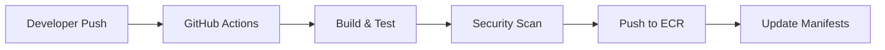
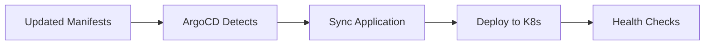

# GitOps Deployment Strategy

## Overview
This document outlines the GitOps approach for deploying the e-voting application using ArgoCD and Kubernetes.

## Repository Structure

### Application Repository (Current)
```
e-voting-applcation/
├── .github/workflows/          # CI/CD pipelines
├── k8s/                       # Kubernetes manifests
│   ├── deploy-fixed.yaml      # Application deployments
│   ├── databases.yaml         # Database components
│   └── aws-managed-db.yaml    # AWS managed services config
├── vote/                      # Vote service source
├── result/                    # Result service source
├── worker/                    # Worker service source
└── evote/                     # Helm charts
```

### Recommended: Separate Config Repository
```
e-voting-config/
├── environments/
│   ├── development/
│   │   ├── kustomization.yaml
│   │   └── values.yaml
│   ├── staging/
│   │   ├── kustomization.yaml
│   │   └── values.yaml
│   └── production/
│       ├── kustomization.yaml
│       └── values.yaml
├── base/
│   ├── vote-app/
│   ├── result-app/
│   ├── worker-app/
│   └── databases/
└── argocd/
    ├── applications/
    └── projects/
```

## GitOps Workflow

### 1. Code Changes → Image Build


### 2. Manifest Changes → Deployment


## ArgoCD Configuration

### Application Definition
```yaml
apiVersion: argoproj.io/v1alpha1
kind: Application
metadata:
  name: e-voting-app
  namespace: argocd
spec:
  project: default
  source:
    repoURL: https://github.com/your-org/e-voting-applcation
    targetRevision: HEAD
    path: k8s
  destination:
    server: https://kubernetes.default.svc
    namespace: e-voting
  syncPolicy:
    automated:
      prune: true
      selfHeal: true
    syncOptions:
    - CreateNamespace=true
```

### Multi-Environment Setup
```yaml
# Development
apiVersion: argoproj.io/v1alpha1
kind: Application
metadata:
  name: e-voting-dev
spec:
  source:
    path: environments/development
  destination:
    namespace: e-voting-dev

# Production  
apiVersion: argoproj.io/v1alpha1
kind: Application
metadata:
  name: e-voting-prod
spec:
  source:
    path: environments/production
  destination:
    namespace: e-voting-prod
```

## Deployment Environments

### Development
- **Trigger**: Push to `develop` branch
- **Auto-deploy**: Yes
- **Database**: In-cluster PostgreSQL/Redis
- **Monitoring**: Basic health checks

### Staging
- **Trigger**: Manual promotion from dev
- **Auto-deploy**: Yes with approval
- **Database**: AWS RDS/ElastiCache (non-prod)
- **Monitoring**: Full observability stack

### Production
- **Trigger**: Push to `main` branch
- **Auto-deploy**: Manual approval required
- **Database**: AWS RDS/ElastiCache (prod)
- **Monitoring**: Full observability + alerting

## Security & Compliance

### Image Security
```yaml
# Trivy scanning in pipeline
- name: Run Trivy scanner
  uses: aquasecurity/trivy-action@master
  with:
    scan-type: 'image'
    image-ref: '${{ env.ECR_REGISTRY }}/vote:${{ github.sha }}'
```

### RBAC Configuration
```yaml
apiVersion: v1
kind: ServiceAccount
metadata:
  name: argocd-application-controller
  namespace: argocd
---
apiVersion: rbac.authorization.k8s.io/v1
kind: ClusterRole
metadata:
  name: argocd-application-controller
rules:
- apiGroups: [""]
  resources: ["*"]
  verbs: ["*"]
```

### Secret Management
```yaml
# External Secrets Operator
apiVersion: external-secrets.io/v1beta1
kind: SecretStore
metadata:
  name: aws-secrets-manager
spec:
  provider:
    aws:
      service: SecretsManager
      region: us-east-1
```

## Monitoring & Observability

### ArgoCD Monitoring
- Application sync status
- Deployment health
- Resource utilization
- Sync history and rollbacks

### Application Monitoring
```yaml
# ServiceMonitor for Prometheus
apiVersion: monitoring.coreos.com/v1
kind: ServiceMonitor
metadata:
  name: e-voting-metrics
spec:
  selector:
    matchLabels:
      app: e-voting
  endpoints:
  - port: metrics
```

## Rollback Strategy

### Automatic Rollback
```yaml
# ArgoCD auto-sync with self-heal
syncPolicy:
  automated:
    prune: true
    selfHeal: true
  retry:
    limit: 5
    backoff:
      duration: 5s
      factor: 2
      maxDuration: 3m
```

### Manual Rollback
```bash
# Rollback to previous version
argocd app rollback e-voting-app

# Rollback to specific revision
argocd app rollback e-voting-app --revision 123
```

## Best Practices

### 1. Separate Concerns
- **Application code**: Source repository
- **Configuration**: Config repository
- **Infrastructure**: Terraform repository

### 2. Environment Promotion
```
Development → Staging → Production
     ↓           ↓          ↓
   Auto-sync   Manual    Manual + Approval
```

### 3. Configuration Management
```yaml
# Use Kustomize for environment-specific configs
# base/kustomization.yaml
resources:
- vote-deployment.yaml
- result-deployment.yaml
- worker-deployment.yaml

# environments/production/kustomization.yaml
resources:
- ../../base
patchesStrategicMerge:
- replica-count.yaml
- resource-limits.yaml
```

### 4. Security Scanning
- Container image scanning
- Kubernetes manifest scanning
- Dependency vulnerability scanning
- SAST/DAST in pipeline

## Implementation Steps

### Phase 1: Basic GitOps
1. Set up ArgoCD in cluster
2. Create application definitions
3. Configure auto-sync for development

### Phase 2: Multi-Environment
1. Create environment-specific configurations
2. Set up staging environment
3. Implement promotion workflows

### Phase 3: Advanced Features
1. Implement progressive delivery
2. Add comprehensive monitoring
3. Set up disaster recovery

## Troubleshooting

### Common Issues
```bash
# Check ArgoCD application status
kubectl get applications -n argocd

# View sync status
argocd app get e-voting-app

# Check application logs
kubectl logs -n argocd deployment/argocd-application-controller

# Force sync
argocd app sync e-voting-app --force
```

### Health Checks
```yaml
# Application health check
spec:
  healthCheck:
    http:
      path: /health
      port: 8080
    initialDelaySeconds: 30
    periodSeconds: 10
```