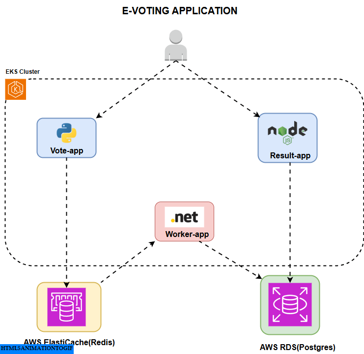

# E-Voting Application

A simple, distributed e-voting application built with microservices architecture using Docker containers. This project demonstrates real-time voting with a web interface and live result updates.

## 🙏 Credits

This project is based on the excellent [Docker Sample Voting App](https://github.com/dockersamples/example-voting-app) by Docker. The original example has been adapted and customized for learning purposes.

Special thanks to the Docker team for providing such a comprehensive example of microservices architecture.

## ☸️ GitOps Deployment

This project supports GitOps deployment using ArgoCD for continuous deployment to Kubernetes.

### Kubernetes Deployment

The application can be deployed to a Kubernetes cluster using the manifests in the `k8s/` folder:

```bash
kubectl apply -f k8s/deploy.yaml
```

### ArgoCD Integration

This repository is configured for GitOps workflows where:
- **ArgoCD** monitors this repository for changes
- **Kubernetes manifests** are located in the `k8s/` folder
- **Infrastructure** is managed separately in the [EKS Production Infrastructure](https://github.com/isrealei/eks-production-infra) repository

### Infrastructure

The production Kubernetes infrastructure (EKS cluster) is provisioned and managed through:
**🔗 [EKS Production Infrastructure Repository](https://github.com/isrealei/eks-production-infra)**

This separation follows GitOps best practices by keeping application manifests and infrastructure code in separate repositories.

## 🏗️ Architecture



This application consists of 5 main components:

### Services
- **Vote Service** (Python/Flask) - Web interface for casting votes
- **Result Service** (Node.js/Express) - Web interface for viewing real-time results
- **Worker Service** (C#/.NET) - Background service that processes votes
- **Redis** - In-memory data store for vote queue
- **PostgreSQL** - Database for storing processed votes

### Architecture Flow
1. Users cast votes through the **Vote** web interface
2. Votes are queued in **Redis**
3. The **Worker** service processes votes from Redis and stores them in **PostgreSQL**
4. The **Result** web interface displays real-time voting results from the database

## 🚀 Quick Start

### Prerequisites
- [Docker](https://docs.docker.com/get-docker/) (20.10 or higher)
- [Docker Compose](https://docs.docker.com/compose/install/) (2.0 or higher)

### Running the Application

1. **Clone the repository:**
   ```bash
   git clone https://github.com/isrealei/e-voting-applcation.git
   cd e-voting-applcation
   ```

2. **Set up environment variables:**
   Create a `.env` file in the root directory:
   ```bash
   POSTGRES_USER=postgres
   POSTGRES_PASSWORD=postgres
   POSTGRES_HOST=db
   POSTGRES_DB=postgres
   REDIS_HOST=redis
   ```

3. **Start the application:**
   ```bash
   docker-compose up -d
   ```

4. **Access the applications:**
   - **Vote Interface**: http://localhost:8080
   - **Results Interface**: http://localhost:8081

### 🎯 Using the Application

1. **Cast your vote:** 
   - Open http://localhost:8080 in your browser
   - Choose between the two options (Cats vs Dogs by default)
   - Click vote!

2. **View results:**
   - Open http://localhost:8081 in your browser
   - Watch the results update in real-time as votes are cast

### 📊 Optional: Seed with Sample Data

To populate the application with sample votes for testing:

```bash
docker-compose --profile seed up -d seed
```

This will generate random votes to help you see the application in action.

## 🛠️ Development

### Project Structure
```
├── vote/                   # Python Flask voting interface
│   ├── app.py             # Main Flask application
│   ├── templates/         # HTML templates
│   └── static/           # CSS and static assets
├── result/                # Node.js results interface
│   ├── server.js         # Main server file
│   └── views/            # Frontend files (HTML, CSS, JS)
├── worker/                # C# background worker
│   ├── Program.cs        # Main worker logic
│   └── Worker.csproj     # Project configuration
├── seed-data/             # Sample data generator
├── healthchecks/          # Health check scripts
└── docker-compose.yaml   # Main orchestration file
```

### Customizing Vote Options

You can customize the voting options by setting environment variables:

```yaml
environment:
  - OPTION_A=Pizza
  - OPTION_B=Burger
```

### Development Mode

To run in development mode with live code reloading:

```bash
docker-compose up --build
```

## 🐳 Docker Services

| Service | Technology | Port | Purpose |
|---------|------------|------|---------|
| vote    | Python/Flask | 8080 | Voting interface |
| result  | Node.js/Express | 8081 | Results display |
| worker  | C#/.NET Core | - | Vote processor |
| redis   | Redis | 6379 | Vote queue |
| db      | PostgreSQL | 5432 | Vote storage |

## 🔧 Configuration

### Environment Variables

The application uses the following environment variables:

| Variable | Default | Description |
|----------|---------|-------------|
| `POSTGRES_USER` | postgres | Database username |
| `POSTGRES_PASSWORD` | postgres | Database password |
| `POSTGRES_HOST` | db | Database host |
| `POSTGRES_DB` | postgres | Database name |
| `REDIS_HOST` | redis | Redis server host |
| `OPTION_A` | Cats | First voting option |
| `OPTION_B` | Dogs | Second voting option |

### Health Checks

The application includes health checks for all services:
- **Vote service**: HTTP health endpoint
- **Database**: Custom PostgreSQL health check script
- **Redis**: Redis ping command

## 🏃‍♂️ Troubleshooting

### Common Issues

1. **Services not starting:**
   ```bash
   docker-compose logs [service-name]
   ```

2. **Port conflicts:**
   - Change the port mappings in `docker-compose.yaml`
   - Or stop services using the conflicting ports

3. **Database connection issues:**
   - Ensure all environment variables are set correctly
   - Check if PostgreSQL container is healthy: `docker-compose ps`

4. **Reset everything:**
   ```bash
   docker-compose down -v
   docker-compose up -d
   ```

## 🧪 Testing

Run the test suite:

```bash
# Run result service tests
cd result
npm test
```

## 📝 License

This project is for educational purposes. Feel free to use and modify as needed.

## 🤝 Contributing

1. Fork the repository
2. Create your feature branch (`git checkout -b feature/amazing-feature`)
3. Commit your changes (`git commit -m 'Add amazing feature'`)
4. Push to the branch (`git push origin feature/amazing-feature`)
5. Open a Pull Request

## 📞 Support

If you encounter any issues or have questions:
1. Check the troubleshooting section above
2. Look at existing issues in the repository
3. Create a new issue with detailed information about your problem

---

**Happy Voting! 🗳️**
# CI/CD Pipeline Active ✅
